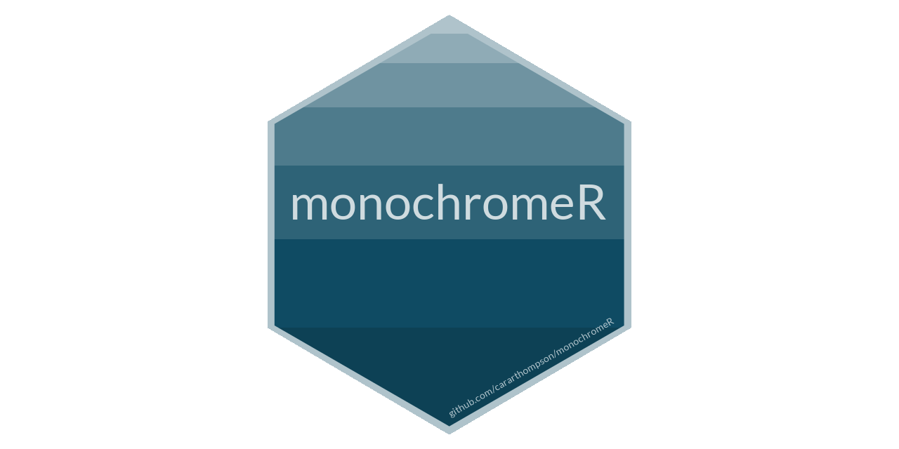
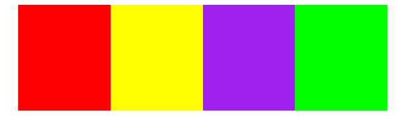
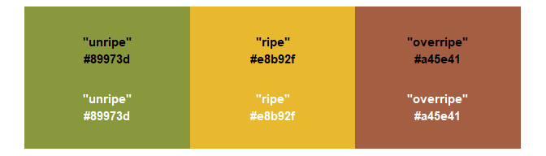
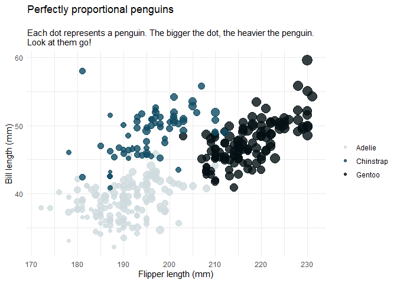

monochromeR: An easy way to create, view and use monochrome colour palettes
================


<!-- badges: start -->
[](https://cran.r-project.org/package=monochromeR)

<!-- badges: end -->



## What does the package do?

This package generates a monochrome palette from a starting colour for a
specified number of colours. Users can decide whether to go darker,
lighter, or both ways from that starting colour, which can be provided
as a vector of rgb values (e.g.B `c(15, 75, 99)`), a hex colour code
(e.g.B `#0F4B63`) or a recognised colour name (e.g.B `"purple"`). The
package can also display the generated palette in the plot window, with
or without hex colour code labels.

## How can I use it?

This package is available on [CRAN](https://cran.r-project.org/), so can
be installed using 
```r 
install.packages("monochromeR")
```

Alternatively, to install it from here, use
```r
remotes::github_install("cararthompson/monochromeR")
```

(To do that, you need to have installed the `remotes` package. To do that, use
`install.packages("remotes")`.)

## Can we see some examples?

Sure! Here goes. To make the examples easy to read, I will use
recognised colour names rather than hex codes or rgb values.

### Generate monochrome palettes with `generate_palette()`

``` r
library(monochromeR)

generate_palette("purple", modification = "go_lighter", 
                 n_colours = 5, view_palette = T)
```

<!-- -->

    ## [1] "#A020F0" "#B34CF3" "#C679F6" "#D9A5F9" "#ECD2FC"

The functions allow for British spelling and US spelling of
colour/color.

``` r
generate_palette("purple", modification = "go_darker", 
                 n_colors = 5, view_palette = T, view_labels = F)
```

<!-- -->

    ## [1] "#A020F0" "#8019C0" "#601390" "#3F0C5F" "#200630"

With more colours, the hex codes get harder to view in the plot. They
are printed in the console when the function is called on its own, and
can also be assigned to an object for later use.

``` r
purple_palette <- generate_palette("purple", modification = "go_both_ways", 
                                   n_colours = 20, view_palette = T, view_labels = F)
```

<!-- -->

``` r
purple_palette
```

    ##  [1] "#ECD2FC" "#E4C0FA" "#DCAEF9" "#D59CF8" "#CD8BF7" "#C679F6" "#BE67F4"
    ##  [8] "#B655F3" "#AF43F2" "#A731F1" "#A020F0" "#931DDC" "#861AC9" "#7918B6"
    ## [15] "#6C15A3" "#601390" "#53107C" "#460E69" "#390B56" "#2C0843"

And just because it was easy to implement, this function can also be
used to blend two colours together:

``` r
generate_palette("purple", blend_colour = "green", 
                 n_colours = 10, view_palette = T, view_labels = F)
```

<!-- -->

    ##  [1] "#A020F0" "#9133DA" "#8347C5" "#755BB0" "#676F9A" "#588385" "#4A9670"
    ##  [8] "#3CAA5A" "#2EBE45" "#20D230"

### Get the hex colour code from an rgb or rgba vector

``` r
# Get hex code from rgb
rgb_to_hex(c(15, 75, 99))
```

    ## [1] "#0F4B63"

``` r
# Get hex code from rgba
rgba_to_hex(c(15, 75, 99, 0.8))
```

    ## [1] "#3E6E82"

#### View any palette, with or without labels

``` r
view_palette(c("red", "yellow", "purple", "green"), view_labels = F)
```

<!-- -->

``` r
view_palette(c(wesanderson::wes_palettes$Moonrise1,
               wesanderson::wes_palettes$Moonrise2[1:2]))
```

<!-- -->

## Worked examples: using `monochromeR` within datavisualisations

### Using `generate_palette` within `scale_colour_manual()`

Heres a simple example, using `{monochromeR}`s `generate_palette()` to
create a colour palette on the fly within `ggplot()`.

``` r
library(tidyverse)
library(monochromeR)

penguin_plot <- palmerpenguins::penguins %>%
  ggplot() +
  geom_point(aes(x = flipper_length_mm, y = bill_length_mm, 
                 colour = species, size = body_mass_g),
             alpha = 0.8) +
 
  labs(title = "Perfectly proportional penguins", 
       subtitle = "\nEach dot represents a penguin. The bigger the dot, the heavier the penguin. \nLook at them go!",
       x = "Flipper length (mm)",
       y = "Bill length (mm)") +
   scale_size(guide = "none") +
 guides(colour = guide_legend(title = "")) +
  theme_minimal() 

penguin_plot
```

<!-- -->

``` r
penguin_plot <- penguin_plot +
 scale_colour_manual(values = generate_palette(c(15, 75, 99), 
                                    modification = "go_both_ways", 
                                    n_colours = 3))

penguin_plot
```

<!-- -->

### Creating a unified aesthetic across all aspects of the dataviz

Heres an example using `{monochromeR}`s `generate_palette()` to
generate all the colours used in the plot, resulting in a more polished
look with minimal effort.

``` r
penguin_palette <- generate_palette(c(15, 75, 99), 
                                    modification = "go_both_ways", 
                                    n_colours = 8,
                                    view_palette = T,
                                    view_labels = F)
```

<!-- -->

``` r
penguin_plot +
  theme_minimal() %+replace%
    theme(plot.background = element_rect(fill = penguin_palette[8], 
                                         colour = penguin_palette[8]),
          panel.grid = element_line(colour = penguin_palette[7]),
          panel.background = element_rect(fill = penguin_palette[8], 
                                          colour = penguin_palette[8]),
          text = element_text(colour = penguin_palette[3]),
          axis.text = element_text(colour = penguin_palette[3]),
          plot.title = element_text(colour = penguin_palette[1], hjust = 0, size = 16),
          plot.subtitle = element_text(colour = penguin_palette[2], hjust = 0))
```

<!-- -->

## Extra resources

### Here are some resources I found helpful in making this package

-   **For the mechanics of how to make a package**: [Your first R
    package in 1
    hour](https://www.pipinghotdata.com/posts/2020-10-25-your-first-r-package-in-1-hour/),
    a tutorial by Shannon Pileggi
-   **For the colour conversions**: [This thread on
    StackOverflow](https://stackoverflow.com/questions/60977641/r-function-for-rgba-to-hex-colour-conversion)
-   **For the logo**: [The hexSticker
    package](https://github.com/GuangchuangYu/hexSticker) by Guangchuang
    Yu

### Bugs and queries

Ive done my best to make the functions in this package user-friendly,
and to make the error messages easy to understand. If you come across a
bug or an error message that doesnt make sense, or if theres something
you think would make this package better, [please let me
know](https://github.com/cararthompson/monochromeR/issues)!
