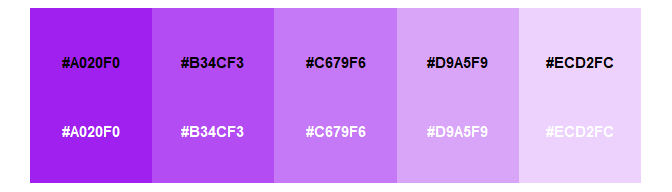

monochromeR: an easy way to create monochrome colour palettes
================


## What does the package do?

Its main function, `generate_palette()`, generates a monochrome palette
from a starting colour for a specified number of colours. Users can
decide whether to go darker, lighter, or both ways from that colour. The
starting colour can be provided as a vector of rgb values
(e.g. `c(15, 75, 99)`), a hex colour code (e.g. `#0F4B63`) or a
recognised colour name (e.g. `"purple"`). To make the examples below
easy to read, I will use colour names. The function also allows users to
view the palette in the plot window if they want to, with or without
labels.

## How can I use it?

To install it, use
`remotes::github_install("cararthompson/monochromeR")`.

## Can we see some examples?

Sure! Here goes.

``` r
library(monochromeR)

generate_palette("purple", modification = "go_lighter", n_colors = 5, view_palette = T)
```

<!-- -->

    ## [1] "#A020F0" "#B34CF3" "#C679F6" "#D9A5F9" "#ECD2FC"

``` r
generate_palette("purple", modification = "go_darker", n_colors = 5, view_palette = T, view_labels = F)
```

<!-- -->

    ## [1] "#A020F0" "#8019C0" "#601390" "#3F0C5F" "#200630"

``` r
generate_palette("purple", modification = "go_both_ways", n_colors = 20, view_palette = T, view_labels = F)
```

<!-- -->

    ##  [1] "#ECD2FC" "#E4C0FA" "#DCAEF9" "#D59CF8" "#CD8BF7" "#C679F6" "#BE67F4"
    ##  [8] "#B655F3" "#AF43F2" "#A731F1" "#A020F0" "#931DDC" "#861AC9" "#7918B6"
    ## [15] "#6C15A3" "#601390" "#53107C" "#460E69" "#390B56" "#2C0843"

And just because it was easy to implement, you can also use this
function to blend two colours together:

``` r
generate_palette("purple", blend_color = "green", n_colors = 10, view_palette = T, view_labels = F)
```

    ## 
    ## Because you supplied a blend_color, the modification variable is set to "blend".
    ## To use other modification options ("go_darker", "go_lighter" or "go_both_ways"),
    ## leave blend_color as NULL.

<!-- -->

    ##  [1] "#A020F0" "#9133DA" "#8347C5" "#755BB0" "#676F9A" "#588385" "#4A9670"
    ##  [8] "#3CAA5A" "#2EBE45" "#20D230"

### Why not just use the `alpha` aesthetic?

Having all solid colours allow us to use `alpha` more interestingly (for
example, to highlight distance from model predictions), and allows
better colour control when the background of the plot isn’t white.

## Does it do anything else?

Yes! The functions that make up `generate_palette()` are useful in and
of themselves:

### Get the hex colour code from an rgb or rgba vector

``` r
# Get hex code from rgb
rgb_to_hex(c(15, 75, 99))
```

    ## [1] "#0F4B63"

``` r
# Get hex code from rgba
rgba_to_hex(c(15, 75, 99, 0.8))
```

    ## [1] "#3E6E82"

### View any palette, with or without labels

``` r
view_palette(c("red", "yellow", "purple", "green"), view_labels = F)
```

<!-- -->

``` r
view_palette(c(wesanderson::wes_palettes$Moonrise1,
               wesanderson::wes_palettes$Moonrise2[1:2]))
```

<!-- -->

## Pulling it all together

Here’s an example using `monochromeR` to generate all the colours used
in the plot, resulting in a unified aesthetic with minimal effort.

``` r
library(tidyverse)
library(monochromeR)

penguin_palette <- generate_palette(c(15, 75, 99), 
                                    modification = "go_both_ways", 
                                    n_colors = 8,
                                    view_palette = T,
                                    view_labels = F)
```

<!-- -->

``` r
palmerpenguins::penguins %>%
  ggplot() +
  geom_point(aes(x = flipper_length_mm, y = bill_length_mm, 
                 colour = species, size = body_mass_g),
             alpha = 0.8) +
  scale_colour_manual(values = penguin_palette[c(2,4,6)]) +
  labs(title = "Perfectly proportional penguins", 
       subtitle = "\nEach dot represents a penguin. Across all three species, the longer the penguins' flippers, 
the longer their bills also. Their weight, represented by the size of the dot, is also correlated 
to their flipper and bill lengths. All things in perfect proportion! ",
       x = "Flipper length (mm)",
       y = "Bill length (mm)") +
   scale_size(guide = "none") +
 guides(colour = guide_legend(title = "")) +
  theme_minimal() %+replace%
    theme(plot.background = element_rect(fill = penguin_palette[8], 
                                         colour = penguin_palette[8]),
          panel.grid = element_line(color = penguin_palette[7]),
          panel.background = element_rect(fill = penguin_palette[8], 
                                          colour = penguin_palette[8]),
         legend.position = "top",
          text = element_text(colour = penguin_palette[3]),
          axis.text = element_text(colour = penguin_palette[3]),
          plot.title = element_text(colour = penguin_palette[1], hjust = 0, size = 18),
          plot.subtitle = element_text(colour = penguin_palette[2], hjust = 0, size = 10))
```

<!-- -->

## Finally, here are some resources I found helpful in making this package

-   **For the machanist of how to make a package**: [Your first R
    package in 1
    hour](https://www.pipinghotdata.com/posts/2020-10-25-your-first-r-package-in-1-hour/),
    a tutorial by Shannon Pileggi
-   **For the colour conversions**: [This thread on
    StackOverflow](https://stackoverflow.com/questions/60977641/r-function-for-rgba-to-hex-color-conversion)
-   **For the logo**: [The hexSticker
    package](https://github.com/GuangchuangYu/hexSticker) by Guangchuang
    Yu

I’ve done my best to make the error messages easy to understand. If you
come across a bug or an error message that doesn’t make sense, [please
let me know](https://github.com/cararthompson/monochromeR/issues)!
